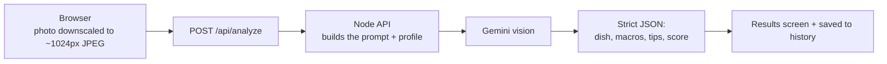

# 🍱 YumAI — Your Food AI & Nutrition Companion

Snap a photo of your plate and YumAI tells you what's actually on it: the dish, the portion,
calories and the full macro breakdown, what's good about it, what to watch out for, and how to
fix the plate next time. Built for students living on hostel mess, canteen, tiffin and ₹50
budget food.

## ✨ What it does

| Feature | What it gives you |
| --- | --- |
| 📸 **Visual food scan** | Take or upload a food photo → dish name, confidence, estimated portion |
| 📊 **Full nutrition** | Calories, protein, carbs, fat, fiber, sugar, sodium + a 0–100 health score |
| 🥗 **Fix my plate** | What's good, what to consider, and practical tiffin-dabba tips |
| 💬 **Food AI chat** | Ask anything about food; answers follow your profile and last scan |
| 🍽️ **What should I eat now?** | Pick your situation (class, exam, sports, travelling) + ₹ budget → 3–5 real options with prices |
| 📜 **Food history** | Every scan saved with a thumbnail; tap to reopen, delete anytime |
| 🔥 **Daily habits** | Streak, 10 scans a day, today's calories and a water counter |
| 👤 **Profile** | Age, weight, height, activity, food preference and health notes shape every answer |

## 🖼 Screens

The interface adapts to the screen size:

- **Phone** — full-width layout with bottom tabs (Home · AI Chat · Eat Now · History)
- **Tablet** — the same single column, roomier
- **Desktop** — a left side rail plus two-column dashboards (scan results, nutrition, eat-now,
  history and profile all use the wider canvas)

## 🧠 How the AI part works



Every AI call goes through this project's own server, so **the API key never reaches the
browser**. The server also walks a short list of Gemini models and falls back automatically if
one is busy or retired — that is what keeps the app working when a model is unavailable to a
key.

## 🚀 Run it locally

```bash
npm install

# terminal 1 — the API (needs a Gemini key)
GEMINI_API_KEY=your_key_here node server/index.mjs   # http://127.0.0.1:8787

# terminal 2 — the app
npm run dev                                           # http://localhost:5173
```

The Vite dev server proxies `/api` to `http://127.0.0.1:8787` (see `vite.config.ts`), so the
frontend always calls its own origin — in development and in production. Keep the key in a
`.env` file or your host's environment; never in the source.

Production build: `npm run build` → `dist/`. The API ships as a container from
`server/Dockerfile`.

## 🧱 Stack

- **Frontend** — React 19, TypeScript, Vite, Tailwind CSS v4
- **API** — one dependency-free Node HTTP server (`server/index.mjs`)
- **AI** — Google Gemini (vision + text) over the REST API, with model fallback
- **Storage** — browser `localStorage` (profile, history, water, streaks); no accounts needed

## 📁 Project layout

```
src/
  screens/      welcome · login/signup · profile · home · scan results · nutrition · eat now · chat · history · privacy
  components/   shared UI: cards, buttons, page container, headers
  lib/          api client · photo downscaling & chime · localStorage store
server/
  index.mjs     /api/analyze · /api/chat · /api/eat-now · /api/health
  Dockerfile    container image for the API
```

## 🔐 Privacy

- Your profile, water count and food history live in **this browser** — clearing browser data
  removes them.
- Photos are downscaled before they are sent, used for that one analysis, and only a small
  thumbnail is kept in your local history.
- The AI key is server-side only.

## ⚠️ Disclaimer

YumAI gives estimates for general guidance. It is not a medical device and not a substitute for
advice from a doctor or dietitian.

## 🎓 Demo

Hackathon demo login: `student@yumai.app` / `yumai123`
